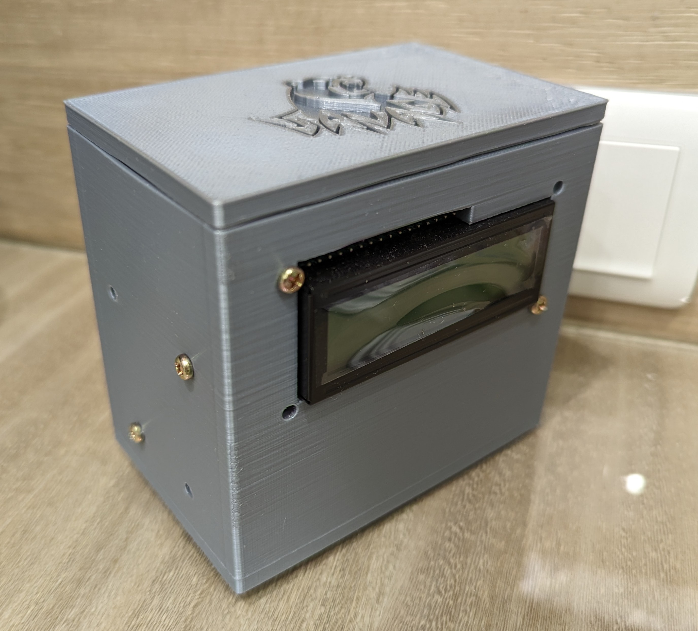
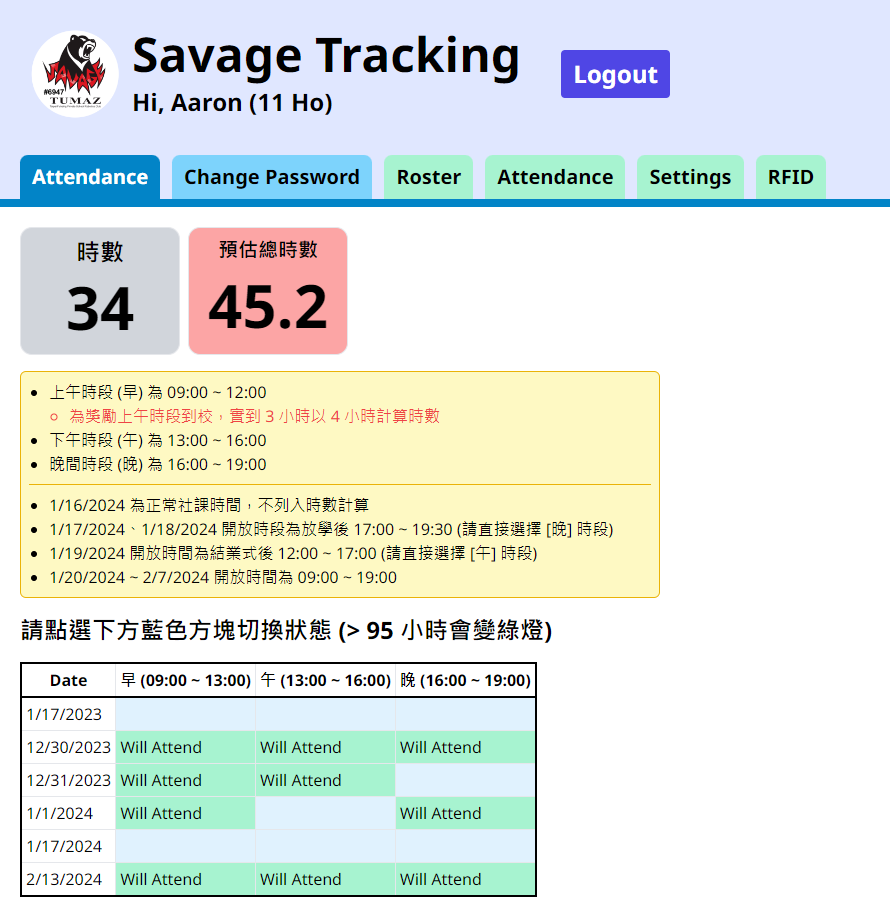
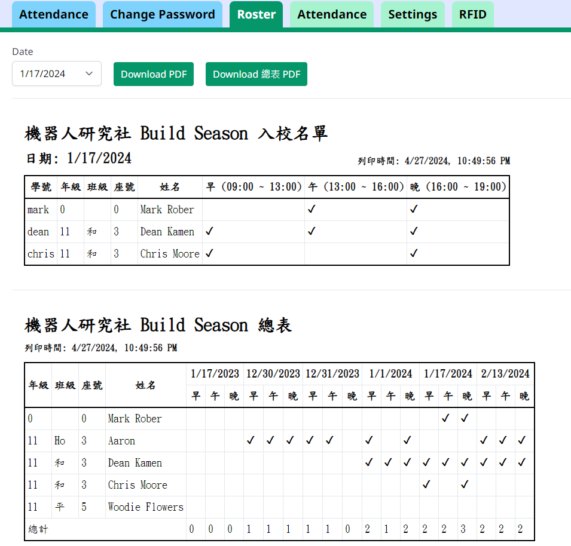
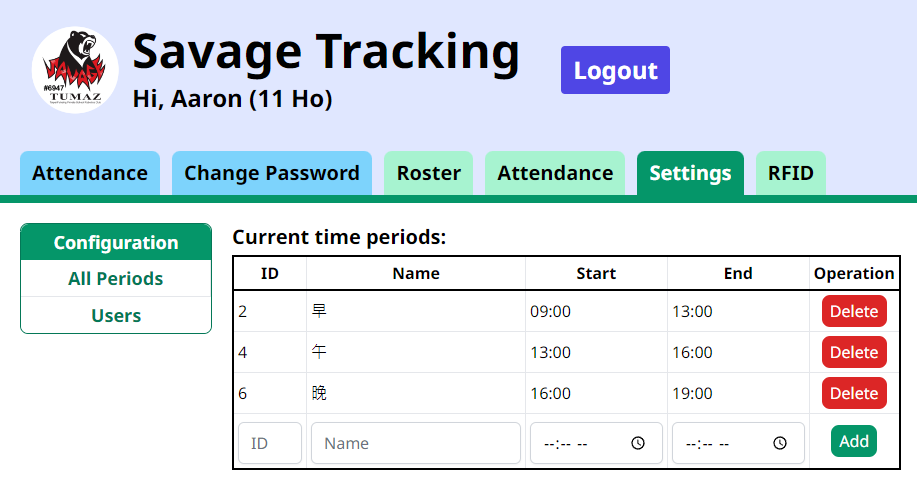
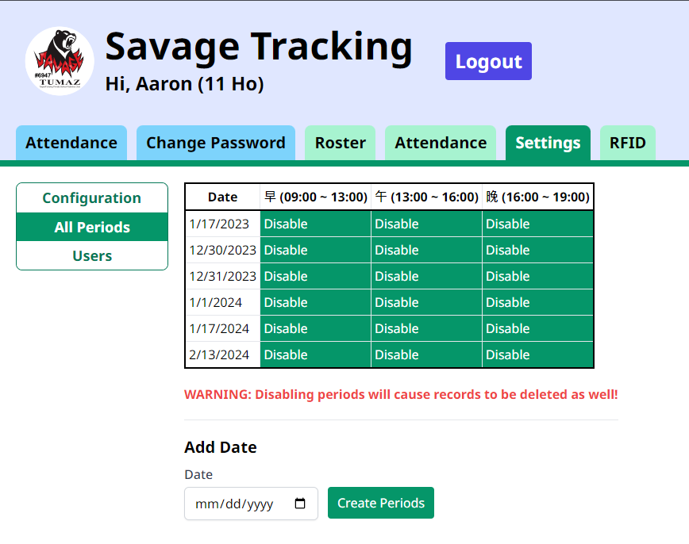
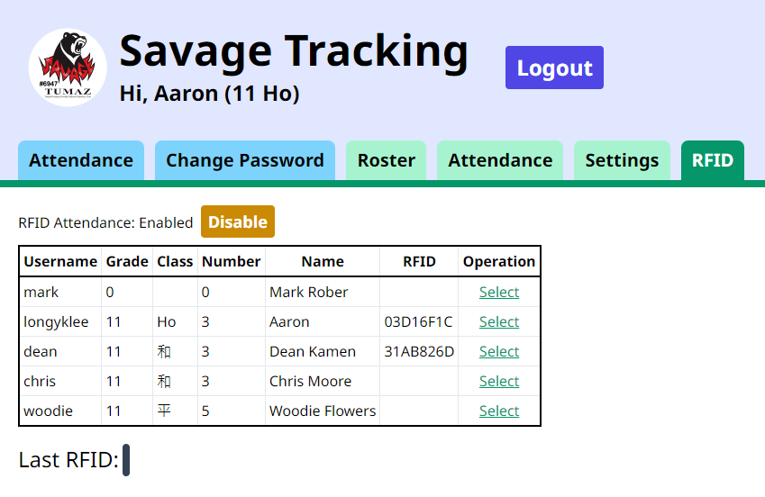
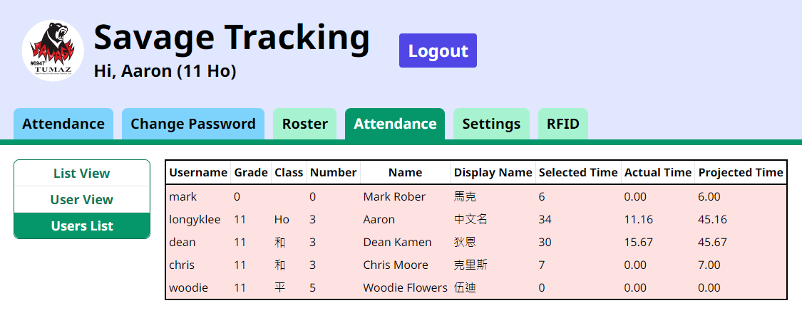
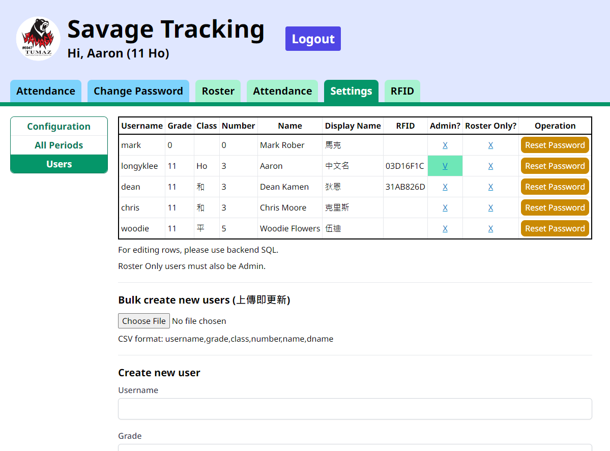

# SavageTracking

Time tracking app for FRC build season personnel management.

Developed by Aaron (me), and used by my FRC Team 6947 Savage Tumaz throughout the 2023-2024 CRESCENDO season, this application serves a dual purpose. Firstly, it logs the hours dedicated by team members during the intensive build season. These hours are a factor in determining eligibility for participation in regional events for our team. Additionally, the application maintains an up-to-date roster, essential for compliance with our school's stringent access control policies.

This project was a part of my Dean's List Award submission that got me named as Finalist at the Central Valley Regional during the 2024 season.

## Tech Stack

This project is written using the [T3 stack](https://create.t3.gg/).

### Frontend

- [Typescript](https://www.typescriptlang.org/)
- [Next.js](https://nextjs.org/)
- [React](https://reactjs.org/)

### Backend

- [tRPC](https://trpc.io/)
- [Prisma](https://www.prisma.io/)
- [PostgreSQL](https://www.postgresql.org/)

## Features

### User-facing
- Connect with Arduino RFID device to record attendance
- Allow users to select the periods in which they will attend

### Administration

- View attendance by user or by time
- Generate daily roster or complete roster
- Easy RFID setup
- 3D printable enclosure
    - ESP8266 (WEMOS D1 R2 V2.1)
    - RC522 (MFRC522)
    - RSI1602 16x2 LCD Display (LiquidCrystal)
- Dynamic periods allowed for selection
- Set required hours
- Set time to allow for period selection

## Pictures

